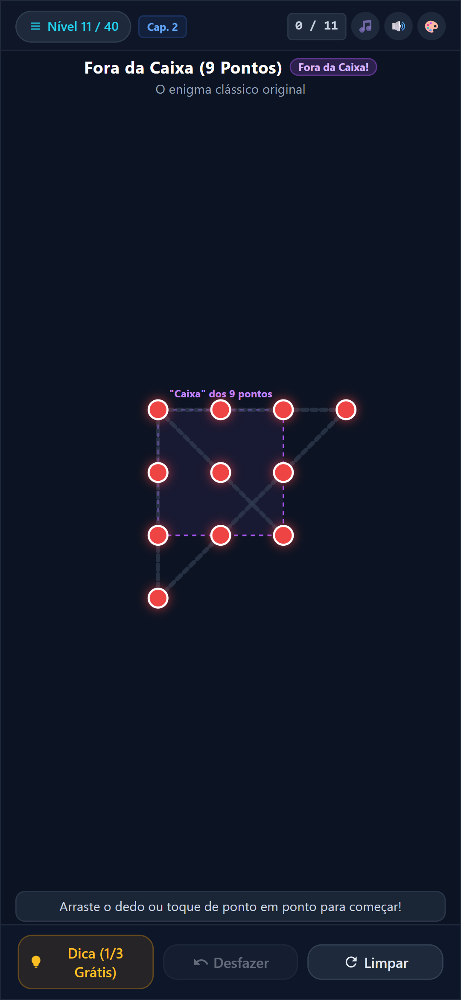
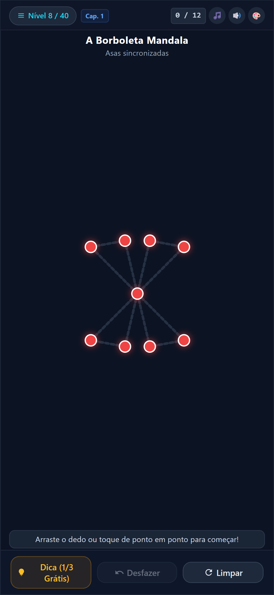
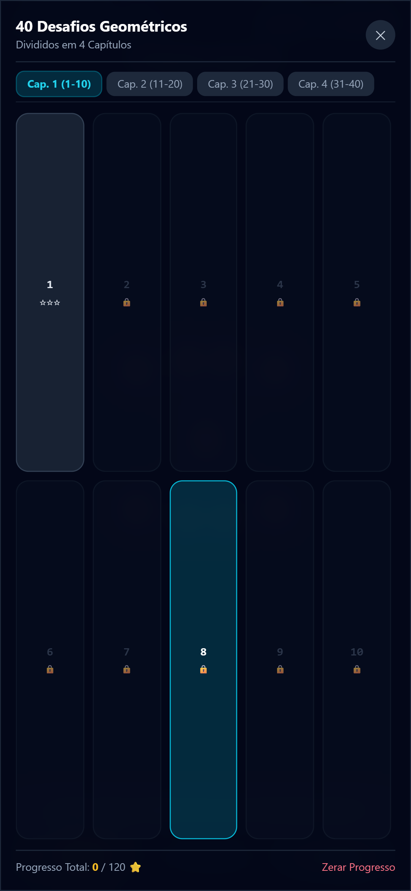
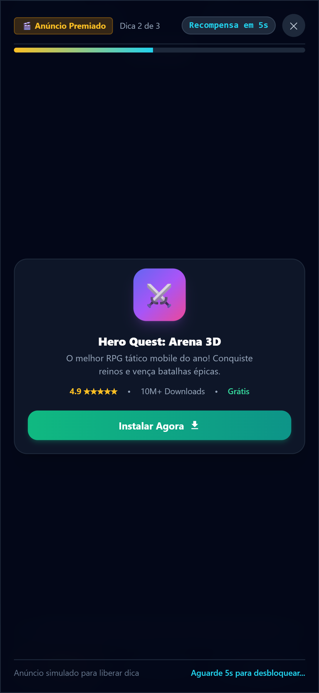

# 🧠 Brain Dots: Traço Único (One Stroke Puzzle)

[](https://saydantas.github.io/brain-dots-game/)
[-3DDC84?style=for-the-badge&logo=android)](https://github.com/Saydantas/brain-dots-game)
[](LICENSE)

> **Conecte todos os pontos sem tirar o dedo da tela e sem repetir nenhuma linha!**  
> Inspirado no clássico enigma dos 9 pontos (*"Think outside the box"*), **Brain Dots** é um jogo de quebra-cabeça e raciocínio lógico projetado para dispositivos móveis com física anticolisão, áudio sintetizado em tempo real e 40 fases eulerianas.

---

## 🎮 Jogue Agora

👉 **Acesse direto pelo navegador ou celular:** [**saydantas.github.io/brain-dots-game**](https://saydantas.github.io/brain-dots-game/)

---

## 📸 Capturas de Tela

| Enigma dos 9 Pontos | Tela de Vitória & Efeitos | Seleção de Capítulos | Dicas & Anúncios |
|:---:|:---:|:---:|:---:|
|  |  |  |  |

---

## 🌟 Principais Recursos

- **40 Fases com Validação Matemática:** Grafos eulerianos rigorosamente verificados com o Teorema de Euler e Algoritmo de Hierholzer (zero linhas colidentes).
- **Física Anticolisão (Bug-Free):** Algoritmo de projeção vetorial impede que o traço passe por cima de pontos intermediários não conectados.
- **Sistema Inteligente de Dicas:** 1ª dica gratuita por fase; 2ª e 3ª dicas liberadas após anúncio recompensado de 5 segundos.
- **Áudio Procedural em Tempo Real:** Síntese sonora pura via Web Audio API (escalas pentatônicas maiores e acordes de vitória harmônicos — 0 KB de arquivos MP3/WAV externos).
- **Temas Visuais Customizáveis:** Cyber Neon, Dark Minimalista e Sunset Glow com partículas dinâmicas.
- **Arquitetura 100% Offline-First:** Funciona sem internet como PWA ou App Nativo Android.

---

## 📚 Documentação Técnica Completa

Para detalhes profundos sobre a engenharia, os algoritmos e a estrutura do código:

📖 [**Ler a Documentação Técnica Completa (TECHNICAL_DOCUMENTATION.md)**](TECHNICAL_DOCUMENTATION.md)  
🚀 [**Guia de Publicação no Google Play (HOW_TO_PUBLISH_GOOGLE_PLAY.md)**](google-play-package/HOW_TO_PUBLISH_GOOGLE_PLAY.md)  
🔒 [**Política de Privacidade Homologada**](google-play-package/playstore-listing/privacy-policy.html)

---

## 🛠️ Expansão Contínua de Fases

O projeto possui um gerador e validador automatizado em Python na pasta `google-play-package/levels-system/`:

```bash
# Validar todas as fases existentes (Teorema de Euler + Conectividade + Colisão)
python google-play-package/levels-system/add_new_level.py --validate

# Gerar 10 novas fases geométricas automaticamente e atualizar o jogo
python google-play-package/levels-system/add_new_level.py --generate 10
```

---

## 📦 Estrutura do Repositório

- `index.html`: Game Engine completa em HTML5 Canvas e ES6 Vanilla.
- `google-play-package/playstore-listing/`: Todos os assets da Google Play Store (Ícone 512x512, Banner 1024x500, Screenshots e Textos ASO).
- `google-play-package/android-source/`: Projeto nativo do Android Studio com WebView acelerada por hardware e Target SDK 34.
- `google-play-package/levels-system/`: Gerador e validador de fases em Python com banco de dados JSON.
- `ci-workflows/`: Pipeline de compilação em nuvem do pacote `.aab` via GitHub Actions.

---

## 📄 Licença

Distribuído sob a licença MIT. Consulte `LICENSE` para mais informações.
