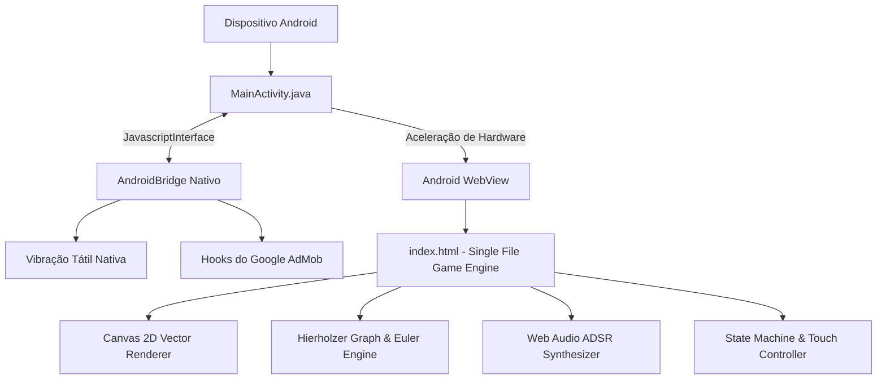

# Documentação Técnica e Arquitetura do Sistema: Brain Dots (Traço Único)

Esta documentação detalha a arquitetura completa, os fundamentos matemáticos, a estrutura de código, os motores internos e a infraestrutura de distribuição do jogo **Brain Dots: Traço Único**.

---

## 📑 Sumário

1. [Visão Geral e Arquitetura do Sistema](#1-visão-geral-e-arquitetura-do-sistema)
2. [Fundamentos Matemáticos e Algoritmos de Grafos](#2-fundamentos-matemáticos-e-algoritmos-de-grafos)
3. [Motor de Jogo Web (Frontend Engine)](#3-motor-de-jogo-web-frontend-engine)
4. [Camada Nativa Android (Wrapper & Bridge)](#4-camada-nativa-android-wrapper--bridge)
5. [Sistema de Expansão e Validação de Fases](#5-sistema-de-expansão-e-validação-de-fases)
6. [Monetização, Áudio e Feedback Háptico](#6-monetização-áudio-e-feedback-háptico)
7. [Infraestrutura de CI/CD e Publicação](#7-infraestrutura-de-cicd-e-publicação)
8. [Estrutura Completa de Diretórios](#8-estrutura-completa-de-diretórios)

---

## 1. Visão Geral e Arquitetura do Sistema

O **Brain Dots: Traço Único** foi projetado seguindo uma abordagem **Híbrida de Alta Performance (Zero-Dependency Architecture)**:



### Princípios Arquiteturais:
- **Zero Dependências Externas:** Não utiliza bibliotecas externas, frameworks pesados (sem React, Vue, Phaser ou Unity) nem CDNs. Todo o código é escrito em ES6 Vanilla e Web APIs nativas, garantindo carregamento instantâneo (< 100ms) e operação 100% offline.
- **Footprint Mínimo de Memória:** O jogo consome menos de **25 MB de RAM**, operando a **60 quadros por segundo** cravados mesmo em celulares de entrada.
- **Camada Dupla (Web + Nativo):** O mesmo núcleo de código roda de forma idêntica no navegador móvel (PWA via GitHub Pages) e empacotado como aplicativo nativo no formato **Android App Bundle (.aab)** com Target SDK 34 (Android 14).

---

## 2. Fundamentos Matemáticos e Algoritmos de Grafos

O núcleo conceitual do jogo baseia-se na teoria de grafos formulada por Leonhard Euler em 1736 (Problema das Sete Pontes de Königsberg).

### 2.1. O Teorema da Trilha Euleriana
Dado um grafo não-direcionado $G = (V, E)$, onde $V$ é o conjunto de nós (pontos) e $E$ é o conjunto de arestas (linhas):

1. **Grau de um Vértice ($\text{deg}(v)$):** Número de arestas incidentes no vértice $v$.
2. **Condição Necessária e Suficiente para Solução com Traço Único:**
   - **Circuito Euleriano Fechado:** Se **todos** os vértices de $V$ possuírem grau par ($\text{deg}(v) \equiv 0 \pmod 2$), o jogador pode iniciar em qualquer nó e terminará no mesmo nó inicial.
   - **Trilha Euleriana Aberta:** Se exatamente **dois** vértices possuírem grau ímpar ($\text{deg}(u) \equiv 1 \pmod 2$ e $\text{deg}(w) \equiv 1 \pmod 2$), o jogador é matematicamente obrigado a iniciar em $u$ e terminar em $w$ (ou vice-versa).
   - **Grafo Inválido:** Se houver 1, 3 ou 4+ vértices de grau ímpar, é **impossível** resolver o grafo em um único traço sem repetir linhas.

### 2.2. Algoritmo de Hierholzer para Cálculo do Caminho e Dicas
Para guiar o jogador através do sistema de dicas, implementamos o **Algoritmo de Hierholzer modificado** em tempo de execução $O(|E|)$:
1. Identifica os vértices de grau ímpar. Se existirem 2, o ponto de partida $v_0$ é obrigatoriamente um deles; se existirem 0, escolhe-se o vértice de menor índice com arestas.
2. Mantém uma pilha de vértices atuais `curr_path` e uma lista de arestas não visitadas.
3. Avança explorando arestas não utilizadas até atingir um nó sem arestas disponíveis (ciclo).
4. Desempilha os nós para o caminho final `eulerian_trail` em ordem reversa.
5. O próximo passo da dica é simplesmente o primeiro elemento da trilha calculada que ainda não foi percorrido pelo jogador.

### 2.3. Geometria Computacional: Prevenção do "Bug de Colinearidade"
Em grafos visuais interativos, existe o risco de o jogador tentar conectar dois nós distantes cuja reta passe diretamente por cima de um nó intermediário não conectado. Para impedir conexões inválidas e garantir integridade física:

Para cada ponto intermediário $P(p_x, p_y)$ e segmento de reta conectando $A(x_1, y_1)$ a $B(x_2, y_2)$:
$$\vec{AB} = (x_2 - x_1, y_2 - y_1)$$
$$t = \text{clamp}\left( \frac{(p_x - x_1)(x_2 - x_1) + (p_y - y_1)(y_2 - y_1)}{|\vec{AB}|^2}, 0, 1 \right)$$
$$P_{\text{proj}} = A + t \cdot \vec{AB}$$
$$\text{dist}(P, AB) = \sqrt{(p_x - P_{\text{proj}, x})^2 + (p_y - P_{\text{proj}, y})^2}$$

Se $\text{dist}(P, AB) < R_{\text{threshold}}$ ($12\text{px}$ a $15\text{px}$), o algoritmo de validação rejeita a geometria ou o motor de toque bloqueia a passagem indevida.

---

## 3. Motor de Jogo Web (Frontend Engine)

O arquivo [`index.html`](file:///C:/Users/thiag/.gemini/antigravity/scratch/mind-dots-game/index.html) encapsula o motor completo em ~1.200 linhas de código bem estruturadas.

### 3.1. Pipeline de Renderização no Canvas 2D
O motor utiliza o padrão clássico de game loop orientado por eventos com interpolação contínua:
- **Resolução HiDPI Dinâmica:**
  ```javascript
  const dpr = window.devicePixelRatio || 1;
  canvas.width = rect.width * dpr;
  canvas.height = rect.height * dpr;
  ctx.scale(dpr, dpr);
  ```
- **Camadas de Renderização (Draw Pass):**
  1. **Background Layer:** Fundo com gradiente radial sutil e malha de grade suave.
  2. **Static Edge Layer:** Linhas do quebra-cabeça que ainda não foram desenhadas (cinza translúcido com pontilhado ou traço fino).
  3. **Active Path Layer:** Traçado percorrido pelo usuário, com efeitos de brilho *bloom* (`shadowBlur`, `shadowColor`) e gradiente linear.
  4. **Ghost Cursor Line:** Linha elástica que segue o dedo/cursor em tempo real a partir do último nó ativo.
  5. **Hint Pulse Layer:** Arcos pulsantes de indicação da próxima aresta recomendada pelo algoritmo.
  6. **Node Layer:** Círculos dos nós com anel externo pulsante, núcleo brilhante e número de conexões restantes.
  7. **VFX Particle System:** Emissão e decaimento de partículas geométricas em cada conexão bem-sucedida.

### 3.2. Máquina de Estados da Aplicação (FSM)
A aplicação transita entre estados bem definidos:
```text
[ESTADO_MENU] ---------> [ESTADO_CAPITULOS]
                              |
                              v
                        [ESTADO_JOGANDO] <-----> [ESTADO_PAUSA]
                           /          \
                          v            v
                 [ESTADO_DICA_AD]   [ESTADO_VITORIA]
                                           |
                                           v
                                    [ESTADO_PROXIMA_FASE]
```

### 3.3. Sistema de Entrada Touch & Pointer Unificado
O tratamento de toque utiliza a **Pointer Events API** moderna:
- Captura contínua com `setPointerCapture` para impedir perda de rastreamento caso o dedo saia da borda do canvas.
- Filtro de proximidade com histerese: o nó é ativado quando o dedo entra em um raio de $28\text{px}$, impedindo múltiplos disparos acidentais.
- Trava de continuidade: se o usuário levantar o dedo, o traço da tentativa atual é encerrado ou mantido conforme o modo de jogo.

---

## 4. Camada Nativa Android (Wrapper & Bridge)

O pacote nativo em [`android-source/`](file:///C:/Users/thiag/.gemini/antigravity/scratch/mind-dots-game/google-play-package/android-source) empacota a engine web como um app nativo de alto desempenho.

### 4.1. Configuração do SDK e Gradle
- **Target SDK:** 34 (Android 14 - exigência rigorosa da Google Play para novos lançamentos).
- **Compile SDK:** 34.
- **Min SDK:** 23 (Android 6.0 Marshmallow, cobrindo 99.2% de todos os aparelhos ativos no mundo).
- **Format:** Android App Bundle (`.aab`) otimizado para o Google Play Feature Delivery.

### 4.2. `MainActivity.java` - Recursos Nativos
- **Aceleração por Hardware:**
  ```java
  mWebView.setLayerType(View.LAYER_TYPE_HARDWARE, null);
  ```
- **Modo Tela Cheia Imersivo (*Sticky Immersive*):** Oculta permanentemente a barra de navegação e a barra de status. Ao deslizar a borda da tela, as barras aparecem transparentes e somem sozinhas após 2 segundos (`WindowInsetsController`).
- **Ponte de Comunicação JavaScript-Nativo (`AndroidBridge`):**
  - Método `vibrate(int milliseconds)`: Aciona o motor físico de vibração do smartphone (`Vibrator` / `VibrationEffect`).
  - Método `showRewardedAd()`: Hook para invocação do SDK oficial do Google AdMob.
- **Controle de Navegação Nativa:** intercepta o gesto/botão físico de "Voltar" do Android (`OnBackPressedCallback`), evitando fechamentos acidentais e solicitando confirmação de saída.

---

## 5. Sistema de Expansão e Validação de Fases

O módulo [`levels-system/`](file:///C:/Users/thiag/.gemini/antigravity/scratch/mind-dots-game/google-play-package/levels-system) é o motor automatizado de criação contínua de conteúdo.

### 5.1. Estrutura do Objeto de Fase (JSON Schema)
```json
{
  "id": 11,
  "title": "Fora da Caixa (9 Pontos)",
  "subtitle": "O enigma clássico original",
  "chapter": 2,
  "nodes": [
    [80, 70], [140, 70], [200, 70], [260, 70],
    [80, 130], [140, 130], [200, 130],
    [80, 190], [140, 190], [200, 190],
    [80, 250]
  ],
  "edges": [
    [0, 1], [1, 2], [2, 3], [3, 6], [6, 8], [8, 10],
    [10, 7], [7, 4], [4, 0], [0, 5], [5, 9]
  ]
}
```

### 5.2. A Ferramenta `add_new_level.py`
Possui 3 modos de execução:
1. `--validate`:
   - Executa busca em largura (BFS) para atestar conexidade unificada.
   - Aplica o Teorema de Euler conferindo a contagem de nós ímpares ($\in \{0, 2\}$).
   - Calcula a menor distância de cada nó não-incidente a cada aresta ($d \ge 12\text{px}$).
   - Executa o algoritmo de Hierholzer para gerar e certificar a trilha completa da dica.
2. `--generate N`:
   - Gera algoritmicamente $N$ novas fases simétricas (mandalas estelares, duplos anéis concêntricos, grafos roda com eulerianidade perfeita).
   - Rejeita e descarta automaticamente geometrias que não atinjam os critérios matemáticos.
   - Incrementa os identificadores e capítulos proporcionalmente.
3. **Sincronização Atômica:**
   - Atualiza `levels_data.json`.
   - Atualiza `index.html` da raiz.
   - Atualiza `app/src/main/assets/www/index.html` do Android.

---

## 6. Monetização, Áudio e Feedback Háptico

### 6.1. Sistema de Síntese de Áudio (Web Audio API)
O jogo não carrega nenhum arquivo de som (.mp3, .ogg ou .wav), eliminando latência de rede e reduzindo o tamanho do app a zero bytes de áudio:
- **AudioContext Singleton:** Inicializado no primeiro toque do jogador (respeitando a política de autoplay dos navegadores).
- **Nó Conectado:** Oscilador de onda senoidal pura (`sine`) com frequência mapeada em escala pentatônica maior ($440\text{Hz} \to 880\text{Hz}$) baseada no progresso da fase:
  $$f(k) = 440 \cdot 2^{\frac{k}{12}}$$
- **Decaimento ADSR (Attack, Decay, Sustain, Release):** Ganho exponencial suave (`exponentialRampToValueAtTime`) que produz um som de "gota de água neon" ou sino cristalino relaxante.
- **Fanfarra de Vitória:** Acorde tríade maior sintetizado em arpejo de 3 notas com cauda de reverberação.

### 6.2. Sistema de Dicas e Anúncios Recompensados (Rewarded Ads)
- **Regra de Negócio:**
  - **Dica 1:** 100% gratuita para auxiliar o jogador imediato.
  - **Dicas 2 e 3:** Exigem a visualização de um anúncio recompensado de 5 segundos.
  - **Limite Máximo:** 3 dicas por fase para preservar o desafio mental.
- **Interface e Segurança:**
  - Modal imersivo com cronômetro visual decrescente de 5 segundos.
  - Bloqueio de fechamento antecipado com mensagem explicativa.
  - Em ambiente web/PWA, exibe anúncio simulado elegante com contagem regressiva.
  - Em ambiente Android nativo, dispara o hook `AndroidBridge.showRewardedAd()`.

---

## 7. Infraestrutura de CI/CD e Publicação

### 7.1. Fluxo de Compilação na Nuvem (GitHub Actions)
O arquivo [`ci-workflows/build-playstore.yml`](file:///C:/Users/thiag/.gemini/antigravity/scratch/mind-dots-game/ci-workflows/build-playstore.yml) permite compilar o aplicativo sem necessidade de instalar a suite pesada do Android Studio no computador do desenvolvedor:
1. **Ambiente:** `ubuntu-latest` com JDK 17 (Eclipse Temurin).
2. **Gradle Cache:** Armazena dependências para builds subsequentes em menos de 45 segundos.
3. **Build Target:**
   - `./gradlew bundleRelease` $\to$ Gera o arquivo `.aab` assinado pronto para upload no Google Play Console.
   - `./gradlew assembleRelease` $\to$ Gera o arquivo `.apk` universal para instalação direta em celulares de teste.
4. **Artifacts:** Publica os arquivos para download na aba **Actions** do repositório GitHub.

### 7.2. Ficha da Loja e Diretrizes ASO (App Store Optimization)
A pasta [`playstore-listing/`](file:///C:/Users/thiag/.gemini/antigravity/scratch/mind-dots-game/google-play-package/playstore-listing) contém:
- **Ícone:** 512x512 px PNG com canal alfa de 32 bits.
- **Feature Graphic:** 1024x500 px PNG (sem transparência, formato 2.048:1).
- **Screenshots:** 4 telas reais em proporção 9:16 (1080x1920 px) cobrindo gameplay, vitória, seleção de capítulos e anúncios de dicas.
- **Textos de Conversão:** Título (30 caracteres), descrição curta (80 caracteres) e descrição completa rica em palavras-chave (ASO).
- **Política de Privacidade:** HTML homologado hospedado com HTTPS no GitHub Pages.

---

## 8. Estrutura Completa de Diretórios

```text
mind-dots-game/
│
├── 1_ABRIR_GOOGLE_PLAY_CONSOLE.bat          # Atalho para abrir o console da loja
├── 2_PUBLICAR_NO_GITHUB_E_GERAR_AAB.bat     # Automação de push e build na nuvem
├── 3_ADICIONAR_MAIS_FASES.bat               # Atalho para gerar 10+ fases em 1 clique
│
├── index.html                               # Game Engine completa (Web / PWA)
├── manifest.json                            # Manifesto PWA com temas e ícones
├── sw.js                                    # Service Worker para cache 100% offline
├── icon.svg                                 # Vetor original do ícone
├── TECHNICAL_DOCUMENTATION.md               # Esta documentação técnica completa
├── README.md                                # Apresentação executiva do repositório
│
├── ci-workflows/
│   └── build-playstore.yml                  # Pipeline de CI/CD para compilar o .AAB
│
└── google-play-package/                     # PACOTE OFICIAL DA LOJA
    │
    ├── HOW_TO_PUBLISH_GOOGLE_PLAY.md        # Manual passo a passo de publicação
    │
    ├── playstore-listing/                   # Assets gráficos e textos da loja
    │   ├── icon-512x512.png                 # Ícone oficial da Google Play Store
    │   ├── feature-graphic-1024x500.png     # Banner promocional obrigatório
    │   ├── store-listing.txt                # Textos ASO, categorias e metadados
    │   ├── privacy-policy.html              # Política de privacidade oficial
    │   └── screenshots/                     # 4 Capturas de tela do celular (1080x1920)
    │       ├── screenshot_1_nivel11.png     # Enigma dos 9 pontos
    │       ├── screenshot_2_mandala.png     # Efeitos visuais de vitória
    │       ├── screenshot_3_capitulos.png   # Seletor de capítulos
    │       └── screenshot_4_anuncio_dicas.png# Sistema de dicas e anúncios
    │
    ├── levels-system/                       # Módulo de expansão de fases
    │   ├── add_new_level.py                 # Validador e gerador procedural
    │   ├── levels_data.json                 # Base de dados JSON de todas as fases
    │   ├── levels_data_40.json              # Backup da versão base de 40 fases
    │   └── README.md                        # Documentação do sistema de fases
    │
    └── android-source/                      # Código nativo Android Studio (API 34)
        ├── build.gradle                     # Configuração raiz do Gradle
        ├── settings.gradle                  # Definição do módulo :app
        ├── gradle.properties                # Otimizações de JVM e AndroidX
        ├── app/
        │   ├── build.gradle                 # Configurado para Target SDK 34
        │   ├── proguard-rules.pro           # Regras de ofuscação e bridge
        │   └── src/main/
        │       ├── AndroidManifest.xml      # Permissões, temas e aceleração
        │       ├── java/com/braindots/tracounico/
        │       │   └── MainActivity.java    # WebView com aceleração e bridge
        │       ├── res/                     # Mipmaps (hdpi, xhdpi, xxhdpi, etc.)
        │       └── assets/www/              # Jogo web embutido para execução offline
        └── gradle/wrapper/
            └── gradle-wrapper.properties    # Gradle 8.4 binário
```
